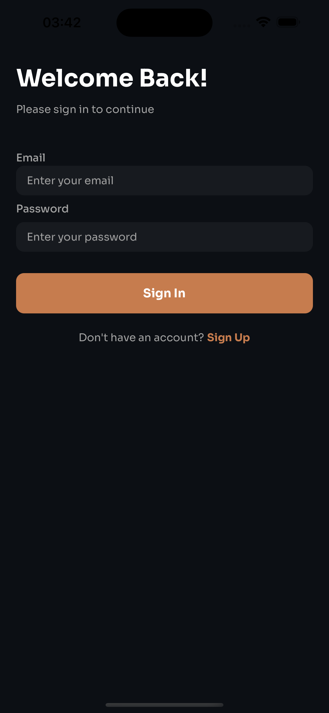
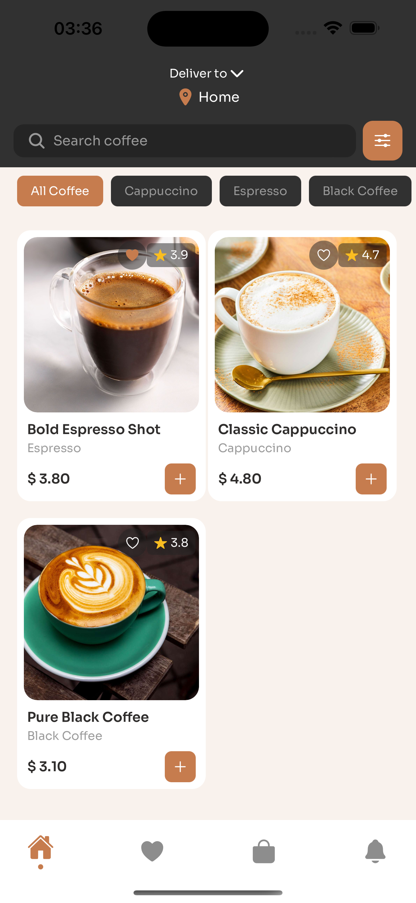
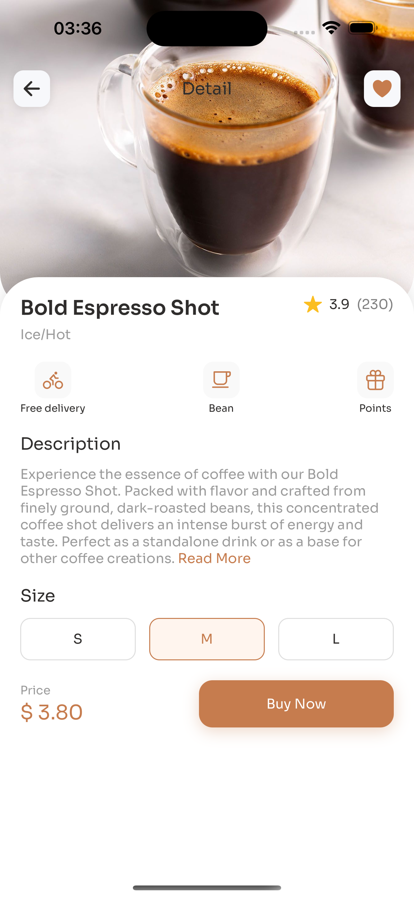
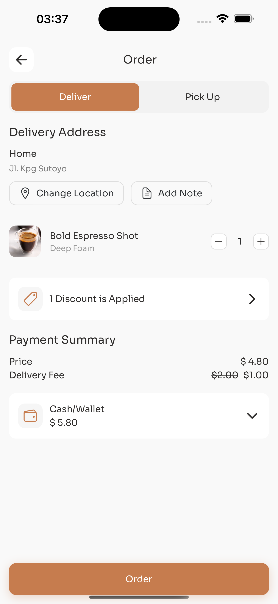

# Coffee Shop Mobile App

A modern, feature-rich mobile application for a coffee shop built with React Native, Expo, TypeScript, and Supabase. The app provides a seamless experience for users to browse coffee products, manage orders, and handle deliveries.

## Features

### 🔐 Authentication

- Secure email & password authentication with Supabase
- User profile management
- Session persistence

### ☕️ Product Browsing

- Browse coffee products by category
- Detailed product views with customization options
- Product search functionality
- Beautiful grid layout with product cards

### 🛒 Shopping Cart

- Add products to cart with size selection
- Adjust quantities
- Real-time price calculations
- Persistent cart state

### ❤️ Favorites

- Save favorite products
- Quick access to favorite items
- Toggle favorites from product cards or detail view

### 📍 Location Management

- Save multiple delivery addresses
- Select default delivery location
- Easy address switching during checkout

### 🛵 Order Management

- Choose between delivery and pickup
- Add delivery notes
- Apply discounts
- Multiple payment methods

### ⚙️ Settings

- Toggle notifications
- Dark mode support
- Language selection
- Profile management
- App preferences

## Technical Stack

- **Frontend Framework**: React Native with Expo
- **Language**: TypeScript
- **State Management**: Zustand
- **Styling**: TailwindCSS (NativeWind)
- **Backend**: Supabase
- **Navigation**: Expo Router
- **Animations**: React Native Reanimated

## Screenshots

<div style="display: flex; flex-wrap: wrap; gap: 10px; justify-content: space-between;">
  
  
  
  
  
  
</div>

## Key Features Implementation

### State Management

- Uses Zustand for global state management
- Separate stores for cart, favorites, and location
- Persistent storage with AsyncStorage

### UI/UX

- Smooth animations using React Native Reanimated
- Consistent design language
- Responsive layouts
- Loading states and error handling

### Navigation

- Tab-based navigation
- Stack navigation for product details
- Modal views for location selection

### Data Persistence

- Cart items persist across sessions
- Favorite products sync with backend
- Saved addresses stored locally

## Getting Started

1. Clone the repository
2. Install dependencies:
   ```bash
   npm install
   ```
3. Set up environment variables:
   ```
   EXPO_PUBLIC_SUPABASE_URL=your_supabase_url
   EXPO_PUBLIC_SUPABASE_ANON_KEY=your_supabase_anon_key
   ```
4. Start the development server:
   ```bash
   npm run dev
   ```

## Database Setup

### 1. Create Supabase Project

1. Go to [Supabase Dashboard](https://app.supabase.com)
2. Click "New Project" and fill in the details:
   - Organization (create one if needed)
   - Project name
   - Database password (save this securely)
   - Region (choose closest to your users)

### 2. Set Up Database Schema

Execute these SQL commands in Supabase SQL Editor:

```sql
-- Create products table
create table products (
  id uuid default uuid_generate_v4() primary key,
  name text not null,
  description text,
  price decimal(10,2) not null,
  image_url text,
  category text,
  rating decimal(2,1),
  created_at timestamp with time zone default timezone('utc'::text, now()) not null
);

-- Create profiles table
create table profiles (
  id uuid references auth.users on delete cascade primary key,
  name text,
  updated_at timestamp with time zone
);

-- Enable Row Level Security (RLS)
alter table products enable row level security;
alter table profiles enable row level security;

-- Create RLS policies
create policy "Products are viewable by everyone" on products
  for select using (true);

create policy "Profiles are viewable by owners" on profiles
  for select using (auth.uid() = id);

create policy "Profiles can be updated by owners" on profiles
  for update using (auth.uid() = id);
```

### 3. Seed Sample Data

Add sample products using this SQL:

```sql
insert into products (name, description, price, image_url, category, rating)
values
  ('Cappuccino', 'Classic Italian coffee drink with equal parts espresso, steamed milk, and milk foam', 4.99, 'https://your-storage-url/cappuccino.jpg', 'Hot Coffee', 4.5),
  ('Latte', 'Espresso with steamed milk and a light layer of milk foam', 4.49, 'https://your-storage-url/latte.jpg', 'Hot Coffee', 4.3),
  ('Cold Brew', 'Smooth, cold-steeped coffee served over ice', 3.99, 'https://your-storage-url/cold-brew.jpg', 'Cold Coffee', 4.7);
```

### 4. Set Up Storage

1. Go to Storage in Supabase Dashboard
2. Create a new public bucket named 'product-images'
3. Update storage policies:
   ```sql
   create policy "Product images are publicly accessible"
   on storage.objects for select
   using (bucket_id = 'product-images');
   ```

### 5. Configure Authentication

1. Go to Authentication settings in Supabase Dashboard
2. Enable Email authentication
3. Configure email templates (optional)
4. Add your app's URL to the Site URL list
5. Set up any additional providers (Google, Apple, etc.)

### 6. Get API Credentials

1. Go to Project Settings > API
2. Copy your:
   - Project URL (EXPO_PUBLIC_SUPABASE_URL)
   - Anon Key (EXPO_PUBLIC_SUPABASE_ANON_KEY)
3. Add these to your .env file

### 7. Enable Realtime Features (Optional)

For real-time updates, enable Realtime in the Database settings:

```sql
-- Enable realtime for products
alter publication supabase_realtime add table products;
```

## Contributing

Contributions are welcome! Please feel free to submit a Pull Request.

## License

This project is licensed under the MIT License - see the LICENSE file for details.
