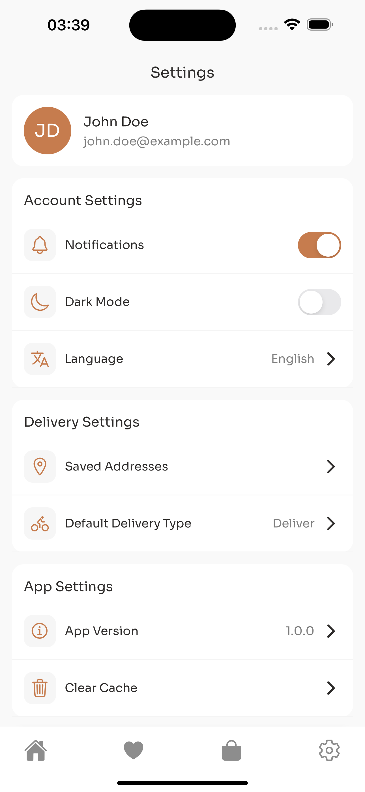

# Coffee Shop Mobile App

A modern, feature-rich mobile application for a coffee shop built with React Native, Expo, TypeScript, and Supabase. The app provides a seamless experience for users to browse coffee products, manage orders, and handle deliveries.

## Features

### 🔐 Authentication

- Secure email & password authentication with Supabase
- User profile management
- Session persistence

### ☕️ Product Browsing

- Browse coffee products by category
- Detailed product views with customization options
- Product search functionality
- Beautiful grid layout with product cards

### 🛒 Shopping Cart

- Add products to cart with size selection
- Adjust quantities
- Real-time price calculations
- Persistent cart state

### ❤️ Favorites

- Save favorite products
- Quick access to favorite items
- Toggle favorites from product cards or detail view

### 📍 Location Management

- Save multiple delivery addresses
- Select default delivery location
- Easy address switching during checkout

### 🛵 Order Management

- Choose between delivery and pickup
- Add delivery notes
- Apply discounts
- Multiple payment methods

### ⚙️ Settings

- Toggle notifications
- Dark mode support
- Language selection
- Profile management
- App preferences

## Technical Stack

- **Frontend Framework**: React Native with Expo
- **Language**: TypeScript
- **State Management**: Zustand
- **Styling**: TailwindCSS (NativeWind)
- **Backend**: Supabase
- **Navigation**: Expo Router
- **Animations**: React Native Reanimated

## Screenshots

### Authentication & Onboarding


_Welcome screen with beautiful background and get started button_

### Product Browsing


_Home screen with product grid and category filters_

### Product Details


_Detailed product view with size selection and add to cart_

### Shopping Cart


_Cart view with product list and checkout button_

### Settings


_Settings screen with various app preferences and logout_

## Key Features Implementation

### State Management

- Uses Zustand for global state management
- Separate stores for cart, favorites, and location
- Persistent storage with AsyncStorage

### UI/UX

- Smooth animations using React Native Reanimated
- Consistent design language
- Responsive layouts
- Loading states and error handling

### Navigation

- Tab-based navigation
- Stack navigation for product details
- Modal views for location selection

### Data Persistence

- Cart items persist across sessions
- Favorite products sync with backend
- Saved addresses stored locally

## Getting Started

1. Clone the repository
2. Install dependencies:
   ```bash
   npm install
   ```
3. Set up environment variables:
   ```
   EXPO_PUBLIC_SUPABASE_URL=your_supabase_url
   EXPO_PUBLIC_SUPABASE_ANON_KEY=your_supabase_anon_key
   ```
4. Start the development server:
   ```bash
   npm run dev
   ```

## Contributing

Contributions are welcome! Please feel free to submit a Pull Request.

## License

This project is licensed under the MIT License - see the LICENSE file for details.
